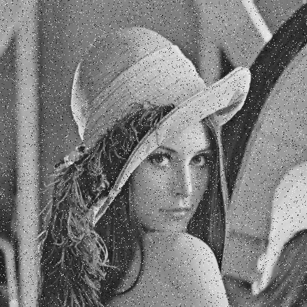
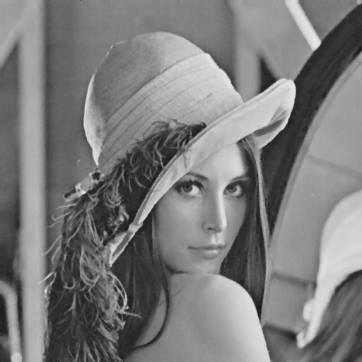

实验图像：


利用python的包skimage进行加噪处理，共包含以下噪声：

```python
mode = [
    'gaussian',
    'localvar',
    'poisson',
    'salt',
    'pepper',
    's&p',
    'speckle',
]
```

对每种噪声进行滤波器处理，共包含以下滤波器：

```python
filters = [
    arithmeticMeanFilter,
    geometricMeanFilter,
    harmonicMeanFilter,
    inverseHarmonicMeanFilter,
    medianFilter,
    maximumFilter,
    minimumFilter,
    medianRangeFilterFilter,
    improvedAlphaMeanFilter,
    AdaptiveMedianFilter,
    skimageGaussian,
    skimageMedian,
]
```

其中最后两个滤波器为skimage自带的高斯模糊和中值滤波器，其余均为自己手动实现滤波器。

如下图所示分别为加椒盐噪声、改进阿尔法均值滤波器、中值滤波器、自适应中值滤波器：






其余滤波器效果均不理想，改进阿尔法均值滤波器很大程度上较少了椒盐噪声，中值滤波器几乎去除了所有的椒盐噪声，自适应中值滤波器不仅去除了所有的椒盐噪声，还保留了图像细节（如帽子纹路）。

完整结果参见路径[image](https://github.com/qq734628996/image_processing/tree/master/homework2/img)下的所有图片。